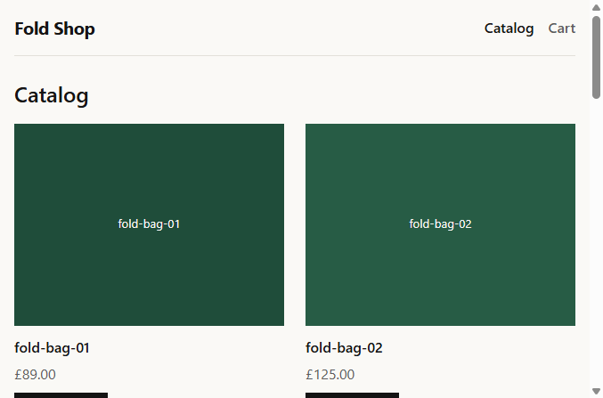

# Fold Shop

React is my daily driver. Fold Shop is a personal Vue 2.7 + TypeScript storefront so the answer to *“tell us about your Vue experience”* is this repo, not a mapping from React. It is a two-market folding-bike accessory shop: prices in integer cents, a namespaced Vuex catalog, and a mock API that does not deploy with the static site.

**Live demo:** [fold-shop.netlify.app](https://fold-shop.netlify.app)  
**Repo:** [github.com/harith2001/fold-shop](https://github.com/harith2001/fold-shop)

> Vue 2.7, TypeScript, Vuex, vue-i18n. Multi-market cart and idempotent checkout. Jest.

## Screenshot



## Stack

| Concern | Choice | Why |
| --- | --- | --- |
| UI | Vue 2.7.16 | Options API, same generation as the target storefront |
| Language | TypeScript 4.9 | Typed `Vue.extend` / `defineComponent`, no class components |
| Bundler | Vue CLI 5 | Conservative Vue 2 toolchain |
| Routing | Vue Router 3.6 | History mode |
| State | Vuex 3.6 | Synchronous mutations, async actions |
| i18n | vue-i18n 8.28 | Wired in a later story; GB ↔ NL stay paired |
| HTTP | axios 1.20 | Dev proxy `/api` → `localhost:4000` |
| Mock API | json-server | In-memory; resets on restart |
| Tests | Jest 27 + Vue Test Utils 1.x | Money, VAT, catalog store |
| CSS | Scoped SCSS | No UI kit |
| Node | 18 LTS | `.nvmrc` |

Pin versions. No `^`, no `latest`, no Vue 3, no Pinia.

## Quick start

Needs **Node 18** and **npm**. Two terminals locally — the SPA and the mock API.

```bash
git clone https://github.com/harith2001/fold-shop.git
cd fold-shop
npm install

# terminal 1
npm run mock

# terminal 2
npm run serve
```

Open [http://localhost:8080](http://localhost:8080). The dev server proxies `/api` to `http://localhost:4000`.

```bash
npm test
npm run lint
npm run build
```

### Live demo vs local

Netlify hosts **only** the static `dist/` build. It does not run `mock-api/server.js`, so `GET https://fold-shop.netlify.app/api/products` is a 404. Production therefore reads the same seed catalog from `mock-api/db.json` inside the bundle (`NODE_ENV === 'production'`). Vuex still loads through `catalog/fetchAll`; only the HTTP adapter changes.

`public/_redirects` contains `/* /index.html 200` so history-mode routes (`/cart`, `/product/2`) do not 404 on refresh.

## Decisions

See [DECISIONS.md](DECISIONS.md) (D1–D13). Short version:

- Vue 2.7 and Vuex 3, not Vue 3 / Pinia — the interview storefront still has mutations.
- Money is integer cents; `Intl.NumberFormat` only at the edge.
- Two list prices per SKU (GBP and EUR). No live FX.
- List prices include VAT; the summary will extract it, not add it.
- Production catalog is bundled. The Node mock stays a local-dev tool.

## Vue 2 reactivity

The scored demo is a cart-line property Vue 2 cannot observe, then the `Vue.set` (or `splice`) fix. Those two commits are not in the history yet. This section will link both SHAs when they land; do not squash them.

Until then the related lesson already in the tree is: catalog list `:key` is `product.id`, never the loop index, and Vuex mutations replace arrays rather than assigning by index.

## What I would do next

Still in this repo, in order: markets + i18n + `PriceTag`, catalog filter/sort, cart + persist, product-page `$route` watch, idempotent checkout, then Playwright on the pay path.

Not in this repo: a Vue 3 rewrite (D10). Dealer pricing and a real warehouse belong on a new app.

## Interview pitch

> React is my daily driver. I built Fold Shop in Vue 2.7 and TypeScript to get production-shaped reps on the Options API, Vuex, and the Vue 2 reactivity system. It is a two-market accessory shop: prices in integer cents, VAT-inclusive summaries, vue-i18n for en-GB and nl-NL. Cart lives in a namespaced Vuex module — async work in actions, synchronous mutations — and persists with a schema version. The two bugs I care about in the demo: the product page reuses the component when only the id changes, so I watch `$route`; and a new field on a cart line did not re-render until `Vue.set`. Checkout sends an idempotency key and ignores a second click while the request is in flight. I did not rewrite it to Vue 3, because the storefront I would be joining is Vue 2.

## Current slice

Shipped and on the demo: app shell, history-mode router, mock catalog, Vuex `catalog` module, catalog grid.

Placeholder routes: product detail, cart, checkout, order outcome. Money and inclusive-VAT helpers are tested in `tests/unit/` ahead of the UI that will call them.
